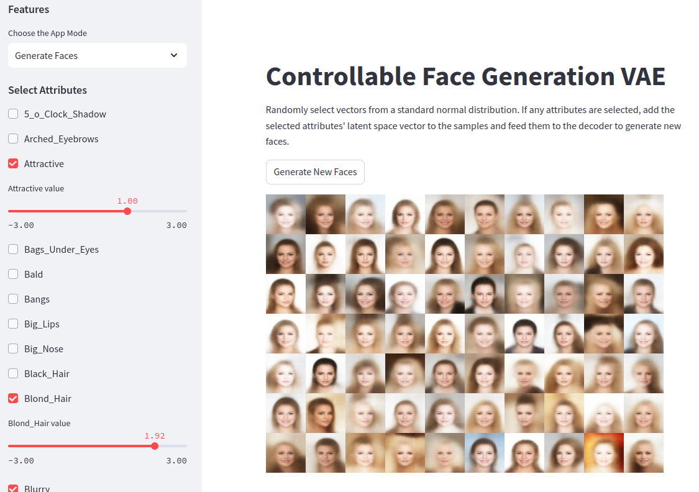
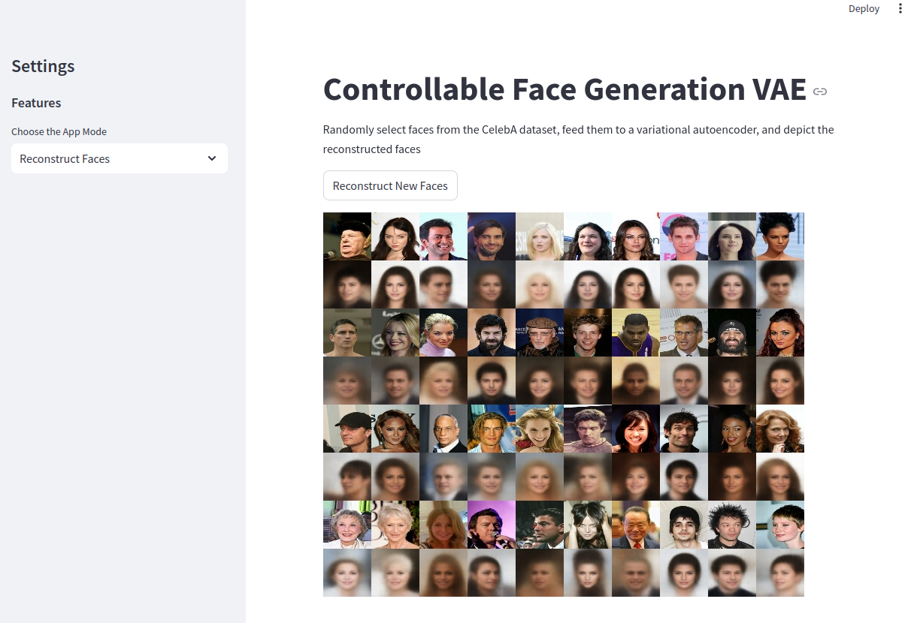
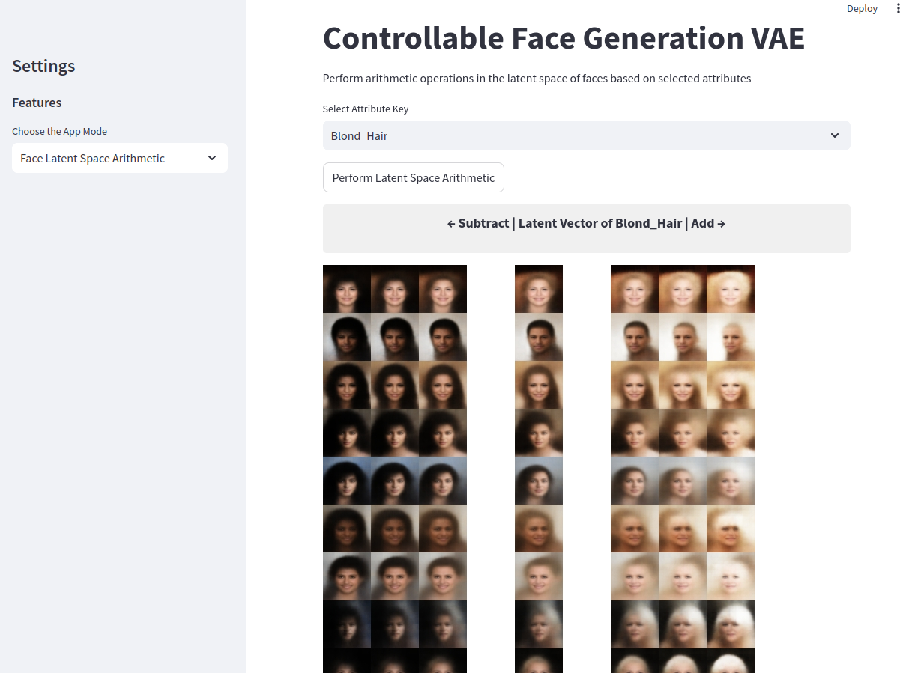
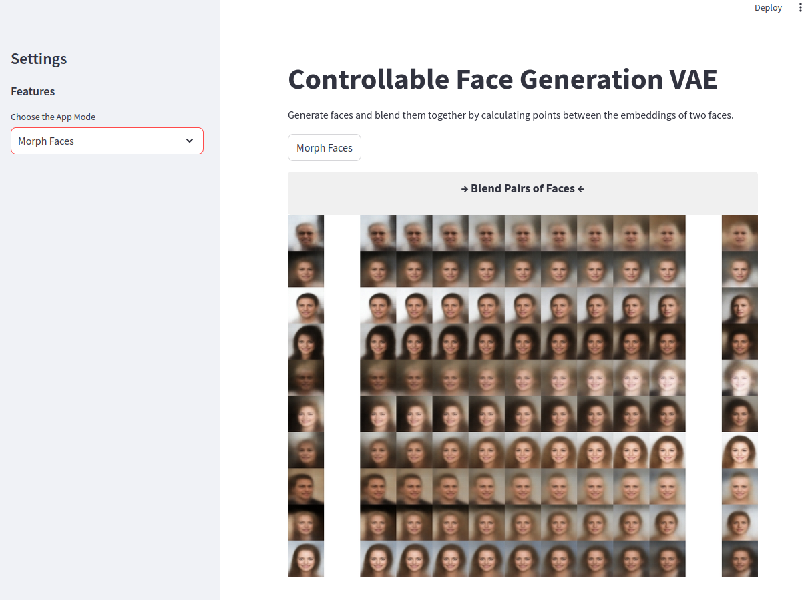

# Controllable Face Generation VAE

  

This project provides a controllable generative model using a Convolutional Variational Autoencoder to generate faces with desirable features. Moreover, it offers additional capabilities such as reconstructing input images, performing latent space arithmetic to enhance or remove attributes in generated images, and morphing pairs of human faces.

The model is trained on the CelebA dataset [1, 2], and TensorFlow Keras and Streamlit were used to create and train the generative neural network, as well as to develop the GUI for straightforward interactive face generation. 

# How to use

- Download Celeba dataset and palce it in data folder, read `data/data_link.txt`. If want to use another directory, change `config/config.json` accordingly.  
- If desired, you can change parameters such as resolution, embedding size, weight of reconstruction loss compared to KL divergence loss, etc., in `config/config.json`.
- Train model with `python train_VAE.py`
- Obtain face attributes for latent space arithmetic with `extract_vector_from_label.py`
- Open interactive GUI for controllable face generation with `streamlit run gui.py `

# Demo

1. Controllable face generation with selected attributes and intensity of features.

  

2. Reconstruct faces by feeding them to a VAE.

  

3. Perform Latent Space Arithmetic to observe the effect of weakening and strengthening a selected feature in generated faces.

  

4. Morph pairs of faces gradually in multiple steps.

  

# To Do
- Replace the model with a more sophisticated one to obtain better results with higher quality.
- Increase resolution of generated images after replacing current neural network.
- Investigate the MS-Celeb-1M (MS1M) dataset after upgrading the model architecture.

# Notice
The project is solely for educational or non-commercial research research purposes. For more information, please refer to the original CelebA license [1].

# References
1 - CelebFaces Attributes (CelebA) Dataset [Link 1](https://www.kaggle.com/datasets/jessicali9530/celeba-dataset) [Link 2](http://mmlab.ie.cuhk.edu.hk/projects/CelebA.html)

2 - (CelebA) Dataset, S. Yang, P. Luo, C. C. Loy, and X. Tang, "From Facial Parts Responses to Face Detection: A Deep Learning Approach", in IEEE International Conference on Computer Vision (ICCV), 2015

3 - Auto-Encoding Variational Bayes, Diederik P Kingma, and Max Welling, [Link](https://arxiv.org/pdf/1312.6114v10)

4- Beta-VAE: Learning Basic Visual Concepts with a Constrained Variational Framework [Link](https://openreview.net/forum?id=Sy2fzU9gl)

5 - Variational AutoEncoder [Link](https://keras.io/examples/generative/vae/)

6 - Generative Deep Learning: Teaching Machines to Paint, Write, Compose, and Play, David Foster, O'Reilly Media; 2nd ed. edition [Link](https://a.co/d/a76CdQv)
